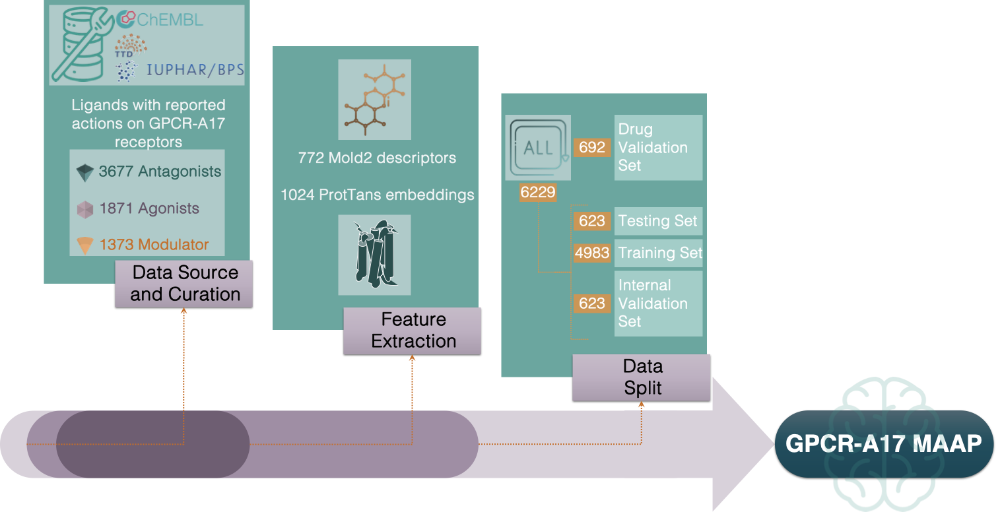

## GPCR-A17 MAAP - Mapping modulators, agonists, and antagonists to Predict the Next Bioactive Target

## Abstract: 
G Protein-Coupled Receptors (GPCRs) are vital players in cellular signalling and key targets for drug discovery, especially within the GPCR-A17 subfamily, which is linked to various diseases. To address the growing need for effective treatments, the GPCR-A17 Modulator, Agonist, Antagonist Predictor (MAAP) was introduced as an advanced ensemble machine learning model designed to predict the functional roles of ligands in GPCR-A17 interactions. Using a dataset of over 3,000 ligands and 6,900 protein-ligand interactions from sources such as the Guide to Pharmacology, Therapeutic Target Database, and ChEMBL, the model demonstrated robust performance. It achieved F1 scores of 0.9217 and 0.6930, AUCs of 0.9804 and 0.8668, and specificities of 0.9717 and 0.8787 for the testing and drug validation datasets, respectively. A Ki-enriched subset of 4,274 interactions improved F1 scores to 0.9330 and 0.8267. By guiding experimental validation, the GPCR-A17 MAAP accelerates drug discovery for various therapeutic targets. The code and data are available on GitHub (https://github.com/MoreiraLAB/GPCR-A17-MAAP).



### Prerequisites:
GPCR-A17 MAAP was developed and tested as follows:
> Python 3.9 (default, July 12 2024)


An isolated Conda environment can be created using the following code:
```bash
cd “change/to/the/directory/where/you/want/to/clone/this/repository”
```
```bash
conda create --name GPCR-A17_MAAP python=3.9
conda activate GPCR-A17_MAAP
```
Note: You can choose any name for the environment by specifying it after the "--name" argument in the first step.

### Requirements:
These requirements can be met by using a pip.
  
* pandas - version 2.1.4 .
* numpy - version  1.26.4 .
* scikit-learn - version 1.2.2 .
* xgboost - version 2.1.0 .
* pytorch-lightning - version 1.9.5 .
* torch - version 2.3.1 .
* transformers - version 4.41.2 .
* protobuf - version 3.20.3 .
* sentencepiece - version 0.2.0 .
* Mold2-pywrapper - version 0.1.0 .
* Joblib – version 1.2.0 .
* Lightgbm – version 4.5.0 .
* Matplotlib – version 3.8.0 .
* Seaborn – version 0.12.2 .
* openpyxl – version 3.1.5 .

After cloning this repository, GPCR-A17 MAAP - Mapping Your Next Bioactive Target can be replicated by following the steps described in section 'Replication' of this repository. 
```bash
git clone https://github.com/MoreiraLAB/GPCR-A17-MAAP.git
cd GPCR-A17-MAAP
```

### Data:

Before starting to use the GitHub repository, please read the README files in each folder and download the required files from Dropbox repository https://bit.ly/40uEb1x into their respective folders.

The ./data/ folder contains the following files: GPCRA17.csv, which includes the full dataset for training and evaluating the GPCR-A17 MAAP; Receptor_sequences.fasta, which contains the sequences of the proteins used in this study (needed for feature extraction by the ProtTrans package); and ligands_A17.csv, which is the CSV file with all unique ligands and their respective SMILES from the dataset. 

The ./dataframes/ folder contains the following datasets: training (TrainDataset.csv), testing (TestDataset.csv), validation (ValidationDataset.csv), and a dataset of unseen drugs (DrugsNeverSeen.csv). Each dataset includes columns for Receptor, Receptor Sequence, Ligand, SMILES, and Action. These datasets are intended for benchmarking purposes.

### Replication of GPCR-A17 MAAP:
Script files: 
After installing and setting up the environment, these scripts should run without requiring any changes, except for modifying the directory in variables.py to point to your GPCR_A17_MAAP repository, where it currently states change/directory/here/to/your/GPCR_A17_MAAP/repository.

 0) **```variables.py```** - Includes variables that are called throughout the pipeline. Ensure that you change the directory to your GPCR_A17_MAAP repository.

```bash
python variables.py
```

 1) **```feature_extraction_prottrans.py```** - Protein features extraction. The output of this script can be found in ./features/prottrans folder.

```bash
python feature_extraction_prottrans.py
```

 2) **``` feature_extraction_mold2.py```** - Ligand features extraction. The output of this script can be found in ./features/mold2 folder.

```bash
python feature_extraction_mold2.py
```
 3) **``` join_features.py```** - Script to combine the features extracted from proteins and ligands. The new dataset can be found in ./features/ folder.

```bash
python join_features.py
```

 4) **``` drug_val_dev.py```** - Script for the development of the drug validation dataset, and creation of the X and y datasets for the remaining and drug validation datasets. The output can be found in ./features/splits/ folder.

```bash
python drug_val_dev.py
```

 5) **``` xgb_5init_feature_import.py```** - Script to train, test, and validate the Extreme Gradient Boosting (XGBoost) base model on the training, testing, and drug validation datasets (drugs never seen). The trained model can be found in ./models/ folder. The hyperparameters optimised with Optuna can be found in ./best_hyperparameters/ folder. Metrics with standard deviation and feature importance plots will be displayed.

```bash
python xgb_5init_feature_import.py
```

6) **``` rf_5init_feature_import.py```** - Script to train, test, and validate the Random Forest (RF) base model on the training, testing, and drug validation datasets (drugs never seen). The trained model can be found in ./models/ folder. The hyperparameters optimised with Optuna can be found in ./best_hyperparameters/ folder. The metrics with standard deviation and the feature importance plots will be displayed.

```bash
python rf_5init_feature_import.py
```

7) **``` gbm_5init_feature_import.py```** - Script to train, test and validate the Light Gradient Boosting Machine (LightGBM) base model on the training, testing and drug validation dataset (drugs never seen). The trained model can be found in ./models/ folder. The hyperparameters optimised with Optuna can be found in ./best_hyperparameters/ folder. The metrics with standard deviation and the feature importance plots will be displayed.

```bash
python gbm_5init_feature_import.py
```

8) **``` gpcr_a17_maap.py```** - Script to train, test, and validate the GPCR-A17 MAAP metamodel on the training, testing, and drug validation datasets (drugs never seen). The trained model can be found in ./models/ folder. The metrics with standard deviation and the feature importance plots will be displayed.

```bash
python gpcr_a17_maap.py
```

### Replication of GPCR-A17 MAAP (Ki-filtered):
Change directory to your ./gpcr_a17_maap_Ki_filtered folder:
```bash
cd ./gpcr_a17_maap_Ki_filtered
```
0) **```variables.py```** - Includes variables that are called throughout the pipeline. Ensure that you change the directory to your /gpcr_a17_maap_Ki_filtered folder in this script.

```bash
python variables.py
```

1) **```feature_extraction_prottrans_Kifiltered.py```** - Protein features extraction. The output of this script can be found in ./features/prottrans folder.

```bash
python feature_extraction_prottrans_Kifiltered.py
```

 2) **```feature_extraction_mold2_Kifiltered.py```** - Ligand features extraction. The output of this script can be found in ./features/mold2 folder.

```bash
python feature_extraction_mold2_Kifiltered.py
```
 3) **```join_features_Kifiltered.py```** - Script to combine the features extracted from proteins and ligands. The new dataset can be found in ./features/ folder.

```bash
python join_features_Kifiltered.py
```

 4) **```drug_val_dev_Kifiltered.py```** - Script for the development of the drug validation dataset, and creation of the X and y datasets for the remaining and drug validation datasets. The output can be found in ./features/splits/ folder.

```bash
python drug_val_dev_Kifiltered.py
```

 5) **```xgb_5init_Kifiltered.py```** - Script to train, test and validate the XGBoost (Ki-filtered) base model on the training, testing and drug validation dataset (drugs never seen). The trained model can be found in ./models/ folder. The hyperparameters optimised with Optuna can be found in ./best_hyperparameters/ folder. The metrics with standard deviation and the feature importance plots will be displayed.

```bash
python xgb_5init_Kifiltered.py
```

6) **```rf_5init_Kifiltered.py```** - Script to train, test, and validate the RF (Ki-filtered) base model on the training, testing, and drug validation datasets (drugs never seen). The trained model can be found in ./models/ folder. The hyperparameters optimised with Optuna can be found in ./best_hyperparameters/ folder. The metrics with standard deviation and the feature importance plots will be displayed.

```bash
python rf_5init_Kifiltered.py
```

7) **```gbm_5init_Kifiltered.py```** - Script to train, test, and validate the GPCR-A17 MAAP (Ki-filtered) metamodel on the training, testing, and drug validation datasets (drugs never seen). The trained model can be found in ./models/ folder. The metrics with standard deviation and the feature importance plots will be displayed.

```bash
python gbm_5init_Kifiltered.py
```

8) **```gpcr_a17_maap_Kifiltered.py```** - Script to train, test and validate the GPCR-A17 MAAP (Ki-filtered) metamodel on the training, testing and drug validation dataset (drugs never seen). The trained model can be found in ./models/ folder. The metrics with standard deviation and the feature importance plots will be displayed.

```bash
python gpcr_a17_maap_Kifiltered.py
```

### New Prediction:
If you want to make a new prediction, you will need the SMILES and sequences of the ligand-GPCR-A17 complexes you are interested in. Additionally, you have two options, depending on whether you have Ki values available for your drug-GPCR-A17 complexes: use GPCR-A17 MAAP or GPCR-A17 MAAP (Ki-filtered).

If you do not have the Ki values available, you can use our GPCR-A17 MAAP to make a new prediction: You will need to prepare an Excel file with the SMILES and sequences of your complexes in the "smile" and "sequence" columns. Save this Excel file as new_prediction.xlsx and place it in the GPCR-A17-MAAP/new_prediction/data folder. An example file is provided in the same folder as reference. Note: Please unzip the X_GPCRA17_Mold_PT.zip file and place the extracted contents in the /data folder. 
Change directory to your GPCR-A17-MAAP/new_prediction/ folder:

```bash
cd ./new_prediction/
```

0) **```variables_new_pred.py```** - Includes variables that are called throughout the pipeline. Ensure you change the directory to the GPCR-A17-MAAP/new_prediction/ folder in this script.

```bash
python variables_new_pred.py
```

1) **``` new_prediction.py```** - Script to create a new prediction using GPCR-A17 MAAP. This will output a CSV file with your predicitons (“predictions_GPCRA17_MAAP.csv”), which can be found in the new_prediction folder.

```bash
python new_prediction.py
```

If you have the Ki values available, you can use our GPCR-A17 MAAP (Ki-filtered) to make a new prediction: 
You will need to prepare an Excel file with the SMILES and sequences of your complexes in the "smile" and "sequence" columns. Additionally, you need to provide the Ki values in a third column named "Ki". Save this Excel file as new_prediction.xlsx and place it in the GPCR-A17-MAAP/gpcr_a17_maap_Ki_filtered/new_prediction/data folder. An example file is provided in the same folder for your reference. Note: Please unzip the X_GPCRA17_ki_filtered_Mold_PT.zip file and place the extracted contents in the /data folder.
Change directory to your ./gpcr_a17_maap_Ki_filtered/new_prediction folder:
```bash
cd ./gpcr_a17_maap_Ki_filtered/new_prediction/
```

0) **```variables_new_pred.py```** - Includes variables that are called throughout the pipeline. Ensure you change in this script the directory to the GPCR-A17-MAAP/gpcr_a17_maap_Ki_filtered/new_prediciton/ folder.

```bash
python variables_new_pred.py
```

1) **``` new_prediction.py```** - Script to make a new prediction using GPCR-A17 MAAP (Ki-filtered). This will output a CSV file with your predicitons (“predictions_GPCRA17_MAAP_Kifiltered.csv”), which can be found in the new_prediction folder.

```bash
python new_prediction_Kifiltered.py
```

Authors:

Ana B. Caniceiro, Ana M. B. Amorim, Nícia Rosário-Ferreira, Irina S. Moreira
